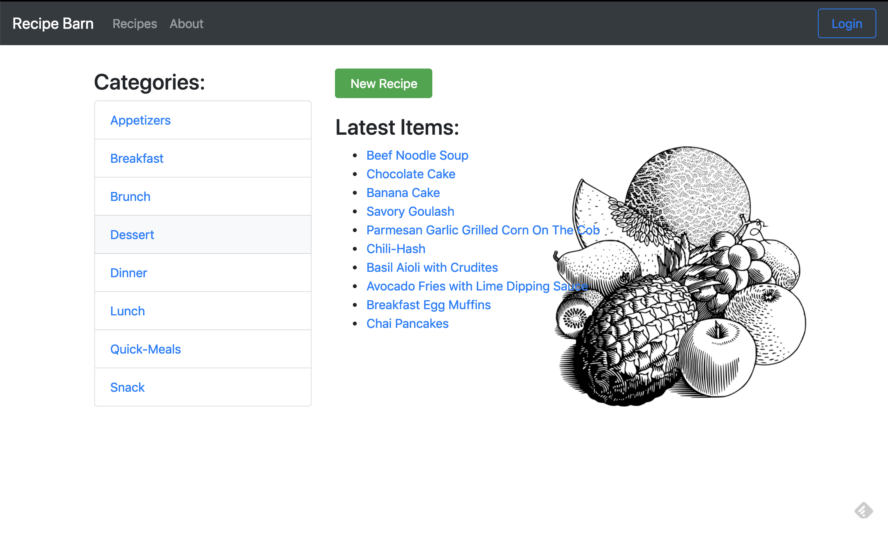
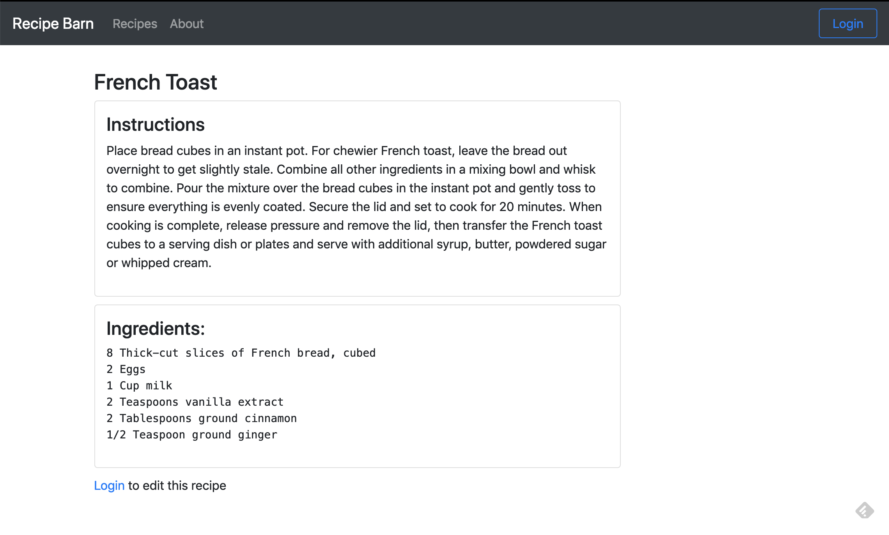
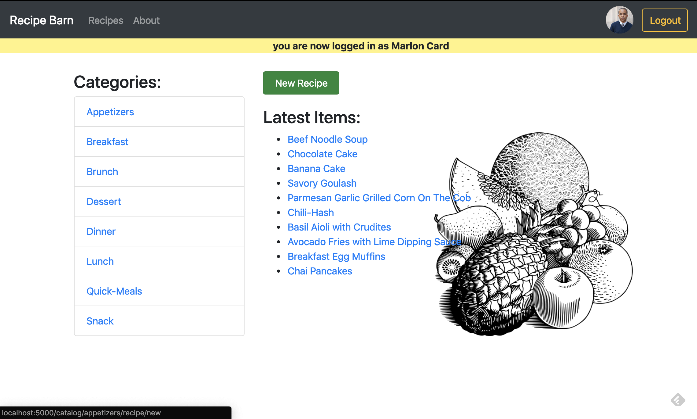
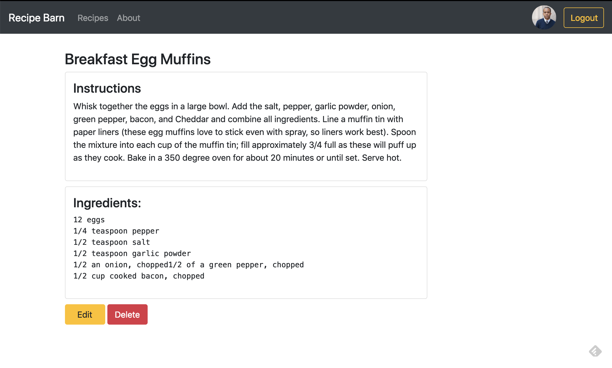
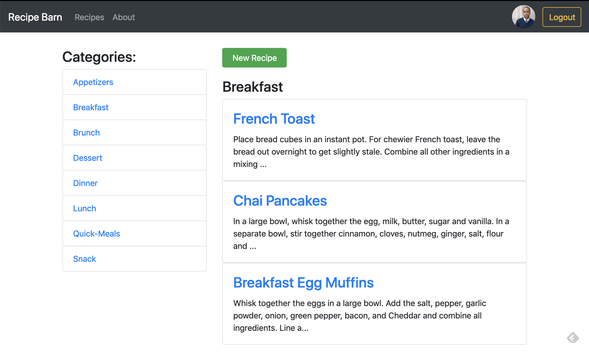
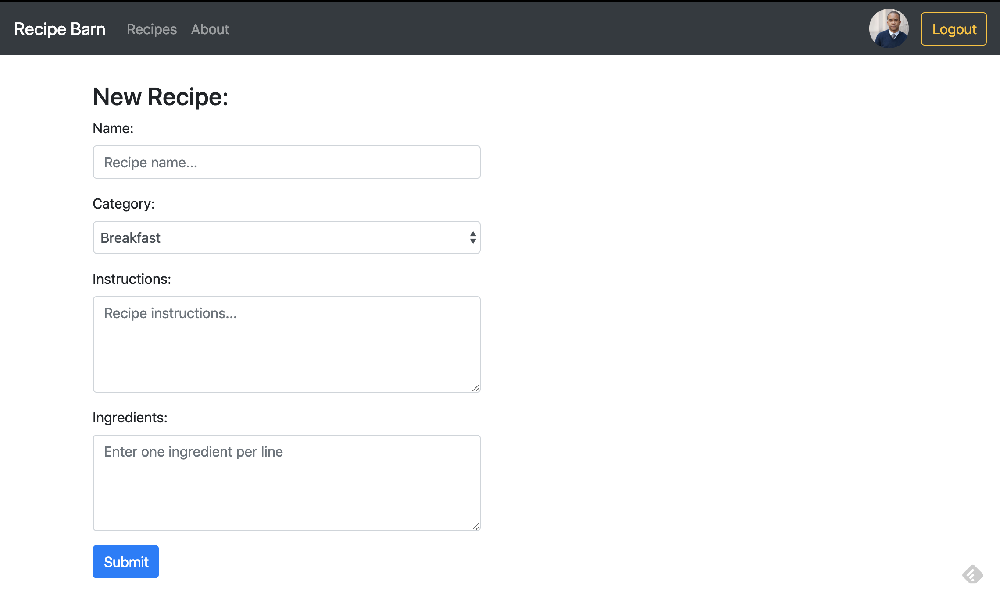
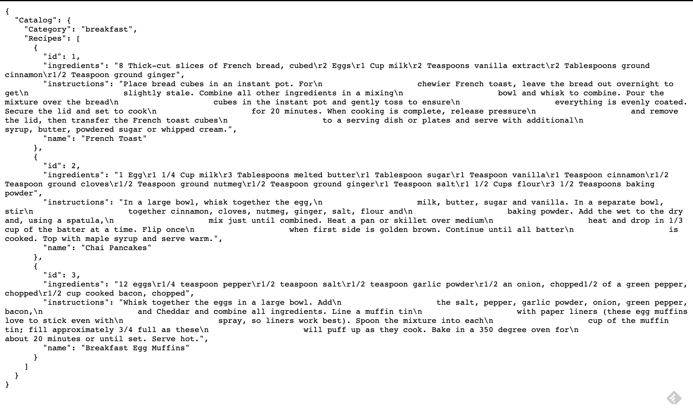

# Catalog App Project
Udacity Full Stack Web Developer Nanodegree

## Project Description
The primary goal of this application is educational. Specifically the objective of the Udacity Item Catalog app project is to develop an application that lists items in a variety of categories which in turn exist in a larger overall catalog. The application will also take advantage of third party authentication systems to allow users to add, edit and delete new items; also providing JSON endpoints.

Topics/Technologies covered:
* [Python](https://www.python.org) programming language
* Third Party [OAuth 2.0](https://oauth.net/2/) authentication (Google and Facebook)
* User registration and authorization
* Mapping [HTTP methods](https://developer.mozilla.org/en-US/docs/Web/HTTP/Methods
) to CRUD (create, read, update and delete) operations
* Developing [RESTful](https://www.ics.uci.edu/~fielding/pubs/dissertation/rest_arch_style.htm
) Web Applications
* [Flask](http://flask.pocoo.org/) web framework
* [SQLAlchemy](https://www.sqlalchemy.org/) object-relational mapper (ORM)
* The application also utilizes [Bootstrap 4](https://getbootstrap.com/), [HTML5](https://developer.mozilla.org/en-US/docs/Web/Guide/HTML/HTML5), [CSS3](https://developer.mozilla.org/en-US/docs/Web/CSS/CSS3), and [jQuery](https://jquery.com/)

### Screenshots

## Setup
The application was developed in Atom text editor in Vagrant VM on Mac OS using Python 2.7.12.
### Vagrant VM
1. Install [Vagrant](https://www.vagrantup.com/) and [VirtualBox](https://www.virtualbox.org/)
2. Clone udacity's [fullstack-nanodegree-vm](http://github.com/udacity/fullstack-nanodegree-vm
)
3. Launch the Vagrant VM from your terminal with `vagrant up` followed by `vagrant ssh`
4. Change into working directory: `cd /vagrant/`

### Clone Repository & Run Server
1. [Fork](https://help.github.com/en/articles/fork-a-repo) this repo to your profile.
2. Create a local [clone](https://help.github.com/en/articles/fork-a-repo#step-2-create-a-local-clone-of-your-fork) of previous fork.
3. Create database and populate with sample data by running `python data.py`
4. Change into the app directory and run: `python views.py`
5. In your browser navigate to: http://localhost:8000

## Usage
To add recipes to the catalog you'll need to login using a Google or Facebook account. You'll then be able to create, edit and delete recipes.

### API Endpoints
`/catalog/category_name/recipes/json` Returns JSON data of all recipes within a category
`/catalog/category_name/recipe/recipe_id/json` Return JSON data for a specific recipe

Homepage Image credit: https://pixabay.com/vectors/fruits-vintage-food-healthy-retro-2026279/
Recipes Credit:
https://github.com/cweber/cookbook
https://www.foodlion.com/

## LICENSE

This repository and its content was created by Marlon Card and is covered under terms of the [MIT License](https://opensource.org/licenses/MIT).
